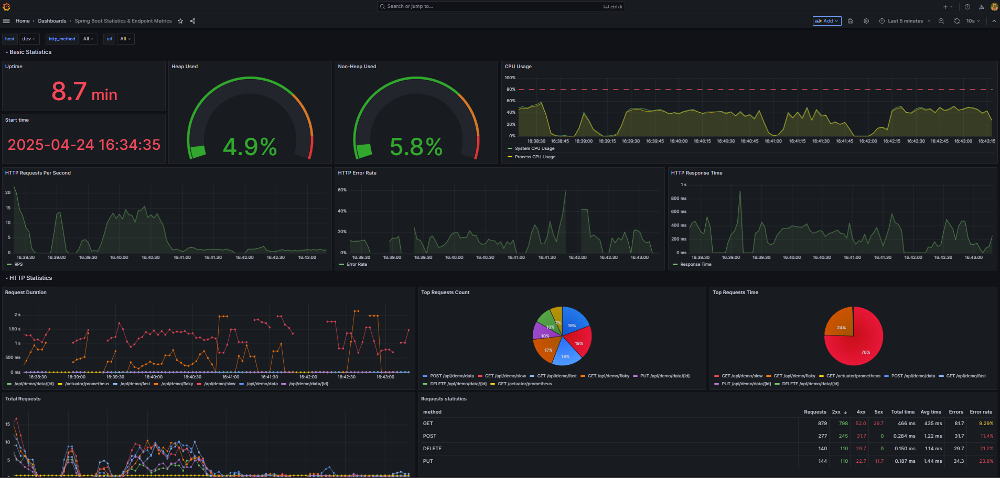
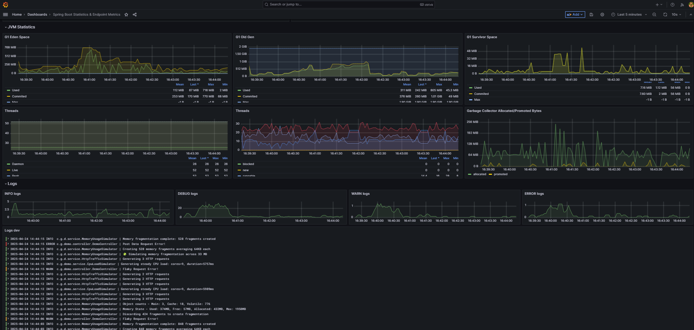

# Spring Boot Monitoring Demo with Grafana

This project demonstrates a complete monitoring setup for Spring Boot applications using Grafana and a suite of observability tools. It showcases real-time metrics, alerting, and logging in an easy-to-deploy package.

## Overview

This demo deploys multiple instances of a Spring Boot application with simulation services that generate realistic workloads. The monitoring stack collects metrics, logs, and allows setting up alerts, giving you a comprehensive view of application performance and behavior.




## Features

- **Complete Monitoring Stack**: Grafana, Prometheus, Alertmanager, and Loki
- **Multiple Application Instances**: Two Spring Boot instances (dev and staging environments)
- **Simulation Services**:
    - CPU load generator
    - Memory usage patterns
    - HTTP traffic simulation
- **Pre-configured Dashboards**: Spring Boot metrics dashboard with detailed endpoint analytics
- **Alerting**: Email notifications for critical events
- **Centralized Logging**: Aggregated logs from all application instances

## Technology Stack

- **Spring Boot**: Application framework
- **Micrometer**: Metrics collection library
- **Prometheus**: Metrics storage and querying
- **Grafana**: Visualization and dashboards
- **Alertmanager**: Alert handling and notifications
- **Loki**: Log aggregation
- **Docker & Docker Compose**: Containerization and orchestration

## Architecture

The system consists of:

1. **Spring Boot Applications**: Two containerized instances with different configurations
2. **Prometheus**: Scrapes metrics from Spring Boot applications
3. **Loki**: Collects logs from the applications
4. **Alertmanager**: Processes alerts from Prometheus and sends notifications
5. **Grafana**: Provides dashboards for all collected data

## Quick Start

### Prerequisites

- Docker and Docker Compose
- Maven
- JDK 21

### Running the Demo

The easiest way to run the demo is using the provided script:

```bash
./build_and_run.sh
```

This will:
1. Build the Spring Boot application with Maven
2. Build and start all Docker containers
3. Configure and connect all monitoring components

Alternatively, you can run the steps manually:

```bash
# Build the Spring Boot application
mvn clean package

# Start all services
docker compose up --build
```

### Accessing the Interface

Once running, you can access:

- **Grafana**: http://localhost:3000 (default credentials: admin/admin)
- **Prometheus**: http://localhost:9090
- **Alertmanager**: http://localhost:9093
- **Spring Boot Apps**:
    - Instance 1: http://localhost:8081 (add /actuator/prometheus for raw metrics)
    - Instance 2: http://localhost:8082 (add /actuator/prometheus for raw metrics)

Try hitting these endpoints to see how they affect the metrics in Grafana!

## Customizing Email Alerts

By default, email alerting is configured but not active until you add your credentials.
To enable email alerts:

1. Edit the `monitoring/alertmanager/config.yml` file and update:
    - `smtp_from`: The email address alerts will be sent from
    - `smtp_auth_username`: Your email login (usually your email address)
    - `smtp_auth_password`: Your email password (for Gmail, use an app password)
    - `email_configs.to`: The email address that will receive alerts

Note: The monitoring system will function normally without email configuration, but you won't receive alert notifications.

## Exploring the Monitoring Dashboard

The Grafana dashboard provides several views:

1. **Basic Statistics**: Uptime, CPU, memory usage, request rates, error rates, and response times
3. **HTTP Statistics**: Performance data for individual API endpoints
4. **JVM Statistics**: Heap usage, garbage collection, and thread details
5. **Logs**: Centralized logs from all application instances

## Simulation Services

The demo includes services that simulate different load patterns:

1. **CPU Load Simulator**: Generates periodic CPU spikes
2. **Memory Usage Simulator**: Creates different memory allocation patterns
3. **HTTP Traffic Simulator**: Generates realistic HTTP traffic to endpoints

These services can be enabled/disabled via environment variables in the docker-compose.yml file:
- `TEST_CPU`: Enable/disable CPU load simulation
- `TEST_MEMORY`: Enable/disable memory usage simulation
- `TEST_HTTP`: Enable/disable HTTP traffic simulation

## Stopping the Demo

To stop all containers:

```bash
docker compose down
```
